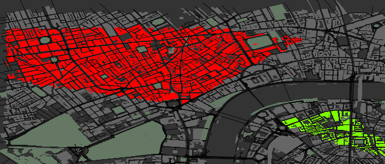

# urbanplotr

R package to produce visually impressive customisable images of urban areas from
OpenStreetMap data, like this:

with functions to make it easy to highlight specific areas, like this:

OSM data are downloaded from the [overpass api](http://overpass-api.de/). There
is no internal check for bounding box sizes, so if they're big, expect downloads
to be time-consuming.
