This vignette extends from the vignette 
([Basic maps](https://cran.r-project.org/package=osmplotr))
to demonstrate how `osmplotr` enables the graphical properties of OpenStreetMap
objects to be modified according to user-provided data.  Categorical data can be
plotted by highlighting defined regions with different colours using
`add_osm_groups`, while continuous data can be plotted with `add_osm_surface`.


```{r load, message = FALSE, eval = FALSE}
library (osmplotr)
```
```{r, echo = FALSE, message = FALSE}
devtools::load_all ("../.", export_all = FALSE)
map_dpi <- 72 # dpi res for all maps
```
As in the first vignette, maps produced in this vignette contain data for a
small portion of central London, U.K.
```{r}
bbox <- get_bbox (c(-0.13, 51.51, -0.11, 51.52))
```

```{r, echo = FALSE, message= FALSE}
dat_B <- rbind (london$dat_BR, london$dat_BNR)
dat_H <- rbind (london$dat_H, london$dat_HP)
dat_HP <- london$dat_HP
```

# 1. Categorical data: `add_osm_groups`

The function `add_osm_groups` enables spatially-defined groups to be plotted in
different colours.  The two primary arguments are `obj`, which defines the OSM
structure to be used for plotting the regions, and `groups` which is a list of
geometric coordinates defining the desired regions. An example of an `obj` is
the Simple Features ([`sf`](https://cran.r-project.org/package=sf)) `data.frame`
of building polygons downloaded in the first vignette with the following line
```{r, eval = FALSE}
dat_B <- extract_osm_objects (key = 'building', bbox = bbox)
```
These data may be obtained by simply combining the data provided with the
package of residential and non-residential buildings to give all buildings as
```{r}
dat_B <- rbind (london$dat_BNR, london$dat_BR)
```

The most direct way to define `groups` is through specifying coordinates of
boundary points:
```{r map1, eval = FALSE}
pts <- cbind (c (-0.115, -0.125, -0.125, -0.115),
              c (51.513, 51.513, 51.517, 51.517))

map <- osm_basemap (bbox = bbox, 
                    bg = 'gray20')

map <- add_osm_groups (map, 
                       dat_B, 
                       groups = pts, 
                       cols = 'orange', 
                       bg = 'gray40')

print_osm_map (map)
```
```{r map1-print, echo = FALSE}

pts <- cbind (c (-0.115, -0.125, -0.125, -0.115),
              c (51.513, 51.513, 51.517, 51.517))

map <- osm_basemap (bbox = bbox, 
                    bg = 'gray20')

map <- add_osm_groups (map, 
                       dat_B, 
                       groups = pts, 
                       cols = 'orange', 
                       bg = 'gray40')

print_osm_map (map, 
               filename = 'map_b1.png', 
               width = 600,
               units = 'px', dpi = map_dpi)
```
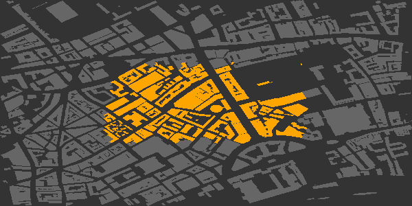

Multiple groups can be defined by passing a list of multiple sets of point
coordinates to the `groups` argument of `add_osm_groups`, and specifying
corresponding colours.

```{r map2, eval = FALSE}
pts2 <- cbind (c (-0.111, -0.1145, -0.1145, -0.111),
               c (51.517, 51.517, 51.519, 51.519))

map <- osm_basemap (bbox = bbox, 
                    bg = 'gray20')

map <- add_osm_groups (map, 
                       dat_B, 
                       groups = list (pts, pts2),
                       cols = c ('orange', 'tomato'), 
                       bg = 'gray40')

print_osm_map (map)
```
```{r map2-print, echo = FALSE}

pts2 <- cbind (c (-0.111, -0.1145, -0.1145, -0.111),
               c (51.517, 51.517, 51.519, 51.519))

map <- osm_basemap (bbox = bbox, 
                    bg = 'gray20')

map <- add_osm_groups (map, 
                       dat_B, 
                       groups = list (pts, pts2),
                       cols = c ('orange', 'tomato'), 
                       bg = 'gray40')

print_osm_map (map, 
               filename = 'map_b2.png', 
               width = 600,
               units = 'px', 
               dpi = map_dpi)
```
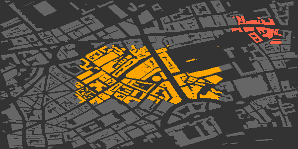

The `bg` argument specifies the colour of any objects lying outside the
boundaries of the specified groups. If this argument is not given, then all
objects are assigned to the nearest group, so that the groups fill the entire
map.

```{r map3, eval = FALSE}

map <- osm_basemap (bbox = bbox, 
                    bg = 'gray20')

map <- add_osm_groups (map, 
                       dat_B, 
                       groups = list (pts, pts2),
                       cols = c ('orange', 'tomato'))

print_osm_map (map)
```
```{r map3-print, echo = FALSE}

map <- osm_basemap (bbox = bbox, 
                    bg = 'gray20')

map <- add_osm_groups (map, 
                       dat_B, 
                       groups = list (pts, pts2),
                       cols = c ('orange', 'tomato'))

print_osm_map (map, 
               filename = 'map_b3.png', 
               width = 600,
               units = 'px', 
               dpi = map_dpi)
```


Now that you've seen the general workflow of `osmplotr`, let's repeat the previous code, but streamline it with `magrittr`'s `%>%` function. This allows us to pipe the functions together instead of re-assigning the `map` variable. 

```{r map_b3_pipe, eval = FALSE}

library(magrittr)

osm_basemap(bbox = bbox,
            bg = 'gray20') %>%
  add_osm_groups(dat_B,
                 groups = list(pts, pts2),
                 cols = c('orange', 'tomato')) %>%
  print_osm_map()
```
```{r map_b3_pipe-print, echo = FALSE}

library(magrittr)

map <- osm_basemap (bbox = bbox, 
                    bg = 'gray20')

map <- add_osm_groups (map, 
                       dat_B, 
                       groups = list (pts, pts2),
                       cols = c ('orange', 'tomato'))

print_osm_map (map, 
               filename = 'map_b3_pipe.png', 
               width = 600,
               units = 'px', 
               dpi = map_dpi)
```

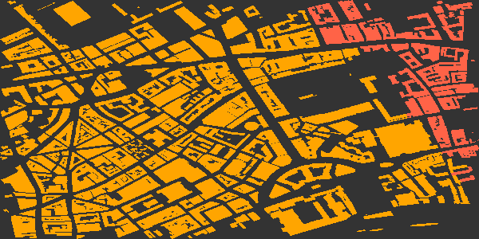


## 1.1 Hulls around groups

`add_osm_groups` includes the argument `make_hull` which specifies whether
convex hulls should be fitted around the points defining the provided `groups`,
or whether the `groups` already define their own boundaries (the default
behaviour). If a point is added internal to the four points defining the first
of the above groups, then the group boundary will connect to that point and
create a concave shape.

```{r map5, eval = FALSE}
pts <- rbind (pts, c (-0.12, 51.515))

osm_basemap (bbox = bbox, 
             bg = 'gray20') %>%
  add_osm_groups (dat_B, 
                  groups = pts, 
                  cols = 'orange', 
                  bg = 'gray40') %>%
  print_osm_map ()
```
```{r map5-print, echo = FALSE}

pts <- rbind (pts, c (-0.12, 51.515))

osm_basemap (bbox = bbox, 
             bg = 'gray20') %>%
  add_osm_groups (dat_B, 
                  groups = pts, 
                  cols = 'orange', 
                  bg = 'gray40') %>%
  print_osm_map (filename = 'map_b5.png', 
                 width = 600,
                 units = 'px',
                 dpi = map_dpi)
```
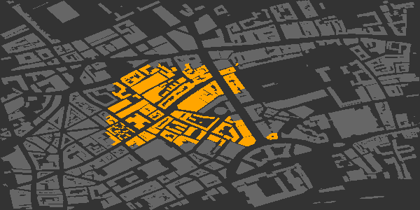

The previous points started in the south-east and ended in the north-east, and
thus the concave boundary extends in between the two easterly points. Setting
`make_hull = TRUE` defines groups by the convex hulls surrounding them, which in
this case would revert this map to the initial map with the group defined by a
regular, convex perimeter.

## 1.2 Inclusive, exclusive, and bisected polygons

The highlighted regions of the previous maps are irregular because the default
behaviour of `add_osm_groups` is to include within a group only those OSM
objects which lie entirely within a group boundary.  `add_osm_groups` has a
`boundary` argument which defines whether objects should be assigned to groups
inclusively (`boundary > 0`) or exclusively (`boundary < 0`), or whether they
should be precisely bisected by a group boundary (`boundary = 0`).  The previous
maps illustrate the default option (`boundary = -1`), while the two other
options produce the following maps. 

```{r map6, eval = FALSE}

osm_basemap (bbox = bbox, bg = 'gray20') %>%
  add_osm_groups (dat_B, 
                  groups = list (pts, pts2), 
                  make_hull = TRUE,
                  cols = c('orange', 'tomato'), 
                  bg = 'gray40',
                  boundary = 1) %>%
  print_osm_map ()
```
```{r map6-print, echo = FALSE}

osm_basemap (bbox = bbox, 
             bg = 'gray20') %>%
  add_osm_groups (dat_B, 
                  groups = list (pts, pts2), 
                  make_hull = TRUE,
                  cols = c('orange', 'tomato'), 
                  bg = 'gray40',
                  boundary = 1) %>%
  print_osm_map (filename = 'map_b6.png', 
                 width = 600,
                 units = 'px', 
                 dpi = map_dpi)
```


The inclusive option (`boundary>0`) includes all objects which have any points
lying within a boundary, meaning more objects are included resulting in larger
regions than the previous default exclusive option. Precisely
bisecting boundaries produces the following map.

```{r map7, eval = FALSE}
osm_basemap (bbox = bbox, 
             bg = 'gray20') %>%
  add_osm_groups (dat_B, 
                  groups = list (pts, pts2), 
                  make_hull = TRUE,
                  cols = c ('orange', 'tomato'), 
                  bg = 'gray40',
                  boundary = 0) %>%
  print_osm_map ()
```
```{r map7-print, echo = FALSE}
osm_basemap (bbox = bbox, 
             bg = 'gray20') %>%
  add_osm_groups (dat_B, 
                  groups = list (pts, pts2), 
                  make_hull = TRUE,
                  cols = c ('orange', 'tomato'), 
                  bg = 'gray40',
                  boundary = 0) %>%
  print_osm_map (filename = 'map_b7.png', 
                 width = 600,
                 units = 'px', 
                 dpi = map_dpi)
```
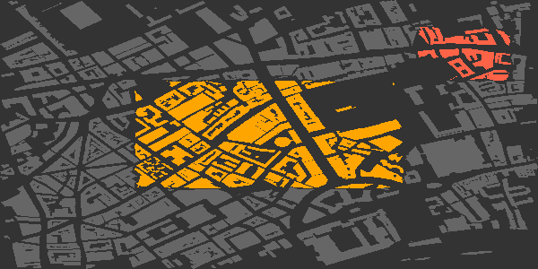


The ability to combine different kinds of boundaries is particularly useful when
highlighting areas which partially contain large polygons such as parks. The
parks within the following maps were downloaded with
```{r, eval = FALSE}
dat_P <- extract_osm_objects (key = 'park', bbox = bbox)
```
(Noting that, as described in the first vignette,
[Basic maps](https://cran.r-project.org/package=osmplotr),
both `extract_osm_objects` and `make_osm_map` convert several common keys to
appropriate `key-value` pairs, so
```{r}
osm_structures (structure = 'park')
```
reveals that this `key` is actually converted to `key = 'leisure'` and
`value = 'park'`.) These data are also provided with the package as
`london$dat_P`.
```{r, echo = FALSE}
dat_P <- london$dat_P
```
Plotting buildings inclusively within each group and overlaying parks bisected
by the group boundaries produces the following map:
```{r map8, eval = FALSE}
col_park_in <- rgb (50, 255, 50, maxColorValue = 255)
col_park_out <- rgb (50, 155, 50, maxColorValue = 255)

osm_basemap (bbox = bbox, 
             bg = 'gray20') %>%
  add_osm_groups (dat_B, 
                  groups = list (pts, pts2), 
                  make_hull = TRUE,
                  cols = c('orange', 'tomato'), 
                  bg = 'gray40',
                  boundary = 0) %>%
  add_osm_groups (dat_P, 
                  groups = list (pts, pts2),
                  cols = rep (col_park_in, 2),
                  bg = col_park_out,
                  boundary = 0) %>%
  print_osm_map ()
```
```{r map8-print, echo = FALSE}
col_park_in <- rgb (50, 255, 50, maxColorValue = 255)
col_park_out <- rgb (50, 155, 50, maxColorValue = 255)

osm_basemap (bbox = bbox, 
             bg = 'gray20') %>%
  add_osm_groups (dat_B, 
                  groups = list (pts, pts2), 
                  make_hull = TRUE,
                  cols = c('orange', 'tomato'), 
                  bg = 'gray40',
                  boundary = 0) %>%
  add_osm_groups (dat_P, 
                  groups = list (pts, pts2),
                  cols = rep (col_park_in, 2),
                  bg = col_park_out,
                  boundary = 0) %>%
  print_osm_map (filename = 'map_b8.png', 
                 width = 600,
                 units = 'px', 
                 dpi = map_dpi)
```
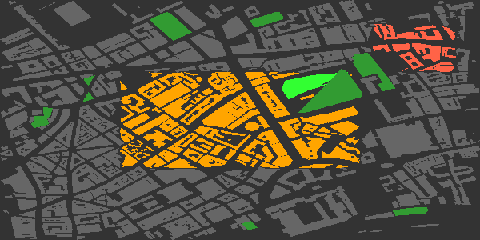

Bisection divides single polygons to form one polygon of points lying within a
given boundary and one polygon of points lying outside the boundary. The two
resultant polygons are often separated by visible gaps between locations at
which they are defined.  Because the layers of a plot are progressively
overlaid, such gaps can be avoided by initially plotting underlying layers using
`add_osm_objects` prior to grouping objects:

```{r map9, eval = FALSE}

map <- osm_basemap (bbox = bbox, 
             bg = 'gray20') %>%
  add_osm_objects (dat_P, 
                   col = col_park_out) %>%
  add_osm_groups (dat_P, 
                  groups = list (pts, pts2),
                  cols = rep (col_park_in, 2), 
                  bg = col_park_out,
                  boundary = 0) %>%
  add_osm_groups (dat_B, 
                  groups = list (pts, pts2), 
                  make_hull = TRUE,
                  cols = c ('orange', 'tomato'), 
                  bg = 'gray40',
                  boundary = 0)

map %>%
  print_osm_map ()
```
```{r map9-print, echo = FALSE}
map <- osm_basemap (bbox = bbox, 
             bg = 'gray20') %>%
  add_osm_objects (dat_P, 
                   col = col_park_out) %>%
  add_osm_groups (dat_P, 
                  groups = list (pts, pts2),
                  cols = rep (col_park_in, 2), 
                  bg = col_park_out,
                  boundary = 0) %>%
  add_osm_groups (dat_B, 
                  groups = list (pts, pts2), 
                  make_hull = TRUE,
                  cols = c ('orange', 'tomato'), 
                  bg = 'gray40',
                  boundary = 0)

map %>%
  print_osm_map (filename = 'map_b9.png', 
                 width = 600,
                 units = 'px', 
                 dpi = map_dpi)
```
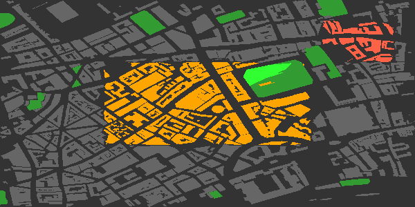

Bisections with `boundary = 0` will only be as accurate as the underlying OSM
data. This example was chosen to highlight that bisection may be inaccurate if
actual OSM points do not lie near to a desired bisection line. The larger a
map, the less visually evident are likely to be any such inaccuracies. Finally,
note that the plot order was changed to allow the building within the park to be
overlaid upon the grass surfaces. Plot order, whether controlled manually or
with `make_osm_map`, may often have to be tweaked to appropriately visualise all
objects.

The `boundary` argument has no effect if `bg` is not given, because in this case
all objects will be assigned to a group and there will be no boundaries between
groups and other, non-grouped objects.

## 1.3 Adjusting colours with `adjust_colours`

The `adjust_colours` function allows different groups to be highlighted with
slightly different colours for different kinds of OSM objects. For example, the
following code adds highways to the above map in slightly darkened versions of
the highlight colours (using `boundary = 1`, so any highways with any points lying
within the bounding box are included in the groups):
```{r map10, eval = FALSE}
#create separate data for all highways and primary highways
dat_H <- rbind (london$dat_H, london$dat_HP)
dat_HP <- london$dat_HP

# darken colours by aboud 20%
cols_adj <- adjust_colours (c ('orange', 'tomato'), 
                            adj = -0.2)

map %>%
  add_osm_groups (dat_HP, 
                groups = list (pts, pts2),
                make_hull = TRUE, 
                cols = cols_adj,
                bg = adjust_colours('gray40', 
                                    adj = -0.4),
                boundary = 1, size = 2) %>%
  add_osm_groups (dat_H, 
                  groups = list (pts, pts2),
                  make_hull = TRUE, 
                  cols = cols_adj,
                  bg = adjust_colours ('gray40', 
                                       adj = -0.2),
                  boundary = 1, 
                  size = 1) %>%
  print_osm_map ()
```
```{r map10-print, echo = FALSE}
# darken colours by aboud 20%
cols_adj <- adjust_colours (c ('orange', 'tomato'), 
                            adj = -0.2)

map %>%
  add_osm_groups (dat_HP, 
                groups = list (pts, pts2),
                make_hull = TRUE, 
                cols = cols_adj,
                bg = adjust_colours('gray40', 
                                    adj = -0.4),
                boundary = 1, size = 2) %>%
  add_osm_groups (dat_H, 
                  groups = list (pts, pts2),
                  make_hull = TRUE, 
                  cols = cols_adj,
                  bg = adjust_colours ('gray40', 
                                       adj = -0.2),
                  boundary = 1, 
                  size = 1) %>%
  print_osm_map (filename = 'map_b10.png', 
                 width = 600,
                 units = 'px', 
                 dpi = map_dpi)
```
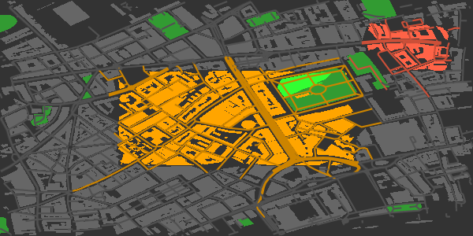

And of course `adjust_colours ('gray40', adj = -0.2)` is nothing other than
'gray32', and `adj = -0.4` gives 'gray24'.

## 1.4 Dark-on-Light Highlights 

A particularly effective way to highlight single regions within a map is through
using dark colours upon otherwise light coloured maps.

```{r map11, eval = FALSE}
osm_basemap (bbox = bbox, bg = 'gray95') %>%
  add_osm_groups (dat_B, 
                  groups = pts, 
                  cols = 'gray40', 
                  bg = 'gray85',
                  boundary = 1) %>%
  add_osm_groups (dat_H, 
                  groups = pts, 
                  cols = 'gray20', 
                  bg = 'gray70',
                  boundary = 0) %>%
  add_osm_groups (dat_HP, 
                  groups = pts, 
                  cols = 'gray10', 
                  bg = 'white',
                  boundary = 0, 
                  size = 1) %>%
  print_osm_map ()
```
```{r map11-print, echo = FALSE}
osm_basemap (bbox = bbox, bg = 'gray95') %>%
  add_osm_groups (dat_B, 
                  groups = pts, 
                  cols = 'gray40', 
                  bg = 'gray85',
                  boundary = 1) %>%
  add_osm_groups (dat_H, 
                  groups = pts, 
                  cols = 'gray20', 
                  bg = 'gray70',
                  boundary = 0) %>%
  add_osm_groups (dat_HP, 
                  groups = pts, 
                  cols = 'gray10', 
                  bg = 'white',
                  boundary = 0, 
                  size = 1) %>%
  print_osm_map (filename = 'map_b11.png', 
                 width = 600,
                 units = 'px', 
                 dpi = map_dpi)
```


## 1.5 Visualising clustering data

One of the most likely uses of `add_osm_groups` is to visualise statistical
clusters. Clustering algorithms will generally produce membership lists which
may be mapped onto spatial locations. Each cluster can be defined as a matrix of
points in a single list of `groups`.  A general approach is illustrated here
with `groups` defined by single, randomly generated points.
```{r}
set.seed (2)
ngroups <- 12
x <- bbox [1, 1] + runif (ngroups) * diff (bbox [1, ])
y <- bbox [2, 1] + runif (ngroups) * diff (bbox [2, ])
groups <- as.list (data.frame (t (cbind (x, y))))
```
(The last line just transforms each row of the matrix into a list item.) Having
generated the points, a map of corresponding clusters can be generated by the
following simple code.

```{r map12, eval = FALSE}
osm_basemap (bbox = bbox, 
             bg = 'gray95') %>%
  add_osm_groups (dat_B, 
                  groups = groups,
                  cols = rainbow (length (groups))) %>%
  print_osm_map ()
```
```{r map12-print, echo = FALSE}
osm_basemap (bbox = bbox, 
             bg = 'gray95') %>%
  add_osm_groups (dat_B, 
                  groups = groups,
                  cols = rainbow (length (groups))) %>%
  print_osm_map (filename = 'map_b12.png', 
                 width = 600,
                 units = 'px', 
                 dpi = map_dpi)
```
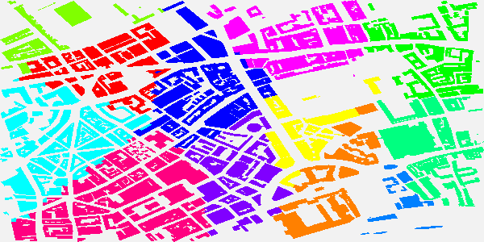

Although individual groups will generally be defined by collections of multiple
points, this example illustrates that they can also be defined by single points.
In such cases, the `bg` option should of course be absent, so that all remaining
points are allocated to the nearest groups.

This map also illustrates the kind of visual mess that may arise in attempts to
specify colours, particularly because the sequence of colours passed to
`add_osm_groups` will generally not map on to any particular spatial order, so
even if a pleasing colour scheme is submitted, the results may still be less
than desirable. Although it may be possible to devise pleasing schemes for small
numbers of groups, manually defined colour schemes are likely to become
impractical for larger numbers of groups.

```{r map13, eval = FALSE}
osm_basemap (bbox = bbox, 
             bg = 'gray95') %>%
  add_osm_groups (dat_B, 
                  groups = groups, 
                  border_width = 2,
                  cols = heat.colors (length (groups))) %>%
  print_osm_map ()
```
```{r map13-print, echo = FALSE}
osm_basemap (bbox = bbox, 
             bg = 'gray95') %>%
  add_osm_groups (dat_B, 
                  groups = groups, 
                  border_width = 2,
                  cols = heat.colors (length (groups))) %>%
  print_osm_map (filename = 'map_b13.png', 
                 width = 600,
                 units = 'px', 
                 dpi = map_dpi)
```


Note the submitting any positive values to the additional `border_width` argument
causes `add_osm_groups` to drawn convex hull borders around the different
groups. Even this is not sufficient, however, to render the result particularly
visually pleasing or intelligible. To overcome this, `add_osm_groups` includes
an option described in the following section to generate spatially sensible
colour schemes for colouring distinct groups.

## 1.6 The Colour Matrix: Colouring Several Regions

An additional argument which may be passed to `add_osm_groups` is `colmat`,
an abbreviation of 'colour matrix'. If set to true (the default is `FALSE`),
group colours are specified by the function `colour_mat`. This function takes
a vector of four or more colours as input, wraps them around the four corners of a
rectangular grid, and spatially interpolates a chromatically regular grid between
these corners. To visual different schemes, it has a `plot` argument:

```{r, eval = FALSE}
cmat <- colour_mat (rainbow (4), plot = TRUE)
```
```{r, fig.width = 4, echo = FALSE}
plot.new ()
cmat <- colour_mat (rainbow (4), plot = TRUE)
```

This grid illustrates the default colours, `rainbow (4)`. The two-dimensional
colour field produced by `colour_mat` may also be rotated by a specified number
of degrees using the `rotate` argument.

```{r, eval = FALSE}
cmat <- colour_mat (rainbow (4), n = c(4, 8), rotate = 90, plot = TRUE)
```
```{r, fig.width = 4, echo = FALSE}
plot.new ()
cmat <- colour_mat (rainbow (4), n = c(4, 8), rotate = 90, plot = TRUE)
```

This example also illustrates that the size of colour matrices may also be
arbitrarily specified. Using the `colmat` option in `add_osm_groups` enables the
previous maps to be redrawn like this:
```{r map14, eval = FALSE}

osm_basemap (bbox = bbox, 
             bg = 'gray95') %>%
  add_osm_groups (dat_B, 
                  groups = groups, 
                  border_width = 2,
                  colmat = TRUE,
                  cols = c('red', 'green', 'yellow', 'blue'), 
                  rotate = 180) %>%
  print_osm_map ()
```
```{r map14-print, echo = FALSE}
osm_basemap (bbox = bbox, bg = 'gray95') %>%
  add_osm_groups (dat_B, 
                  groups = groups, 
                  border_width = 2,
                  colmat = TRUE,
                  cols = c('red', 'green', 'yellow', 'blue'), 
                  rotate = 180) %>%
  print_osm_map (filename = 'map_b14.png', 
                 width = 600,
                 units = 'px', 
                 dpi = map_dpi)
```
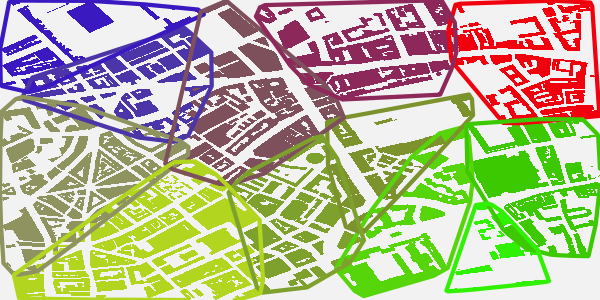

Note both that when `add_osm_groups` is called with `colmat = TRUE`, then `cols`
need only be of length 4, to specify the four corners of the colour matrix, and
also that the `rotate` argument can be submitted to `add_osm_groups` and passed
on to `colour_mat`.


## 1.7 Bounding areas within named highways

As explained in the first vignette,
[Basic maps](https://cran.r-project.org/package=osmplotr),
the function `connect_highways` takes a list of OSM highway names and a bounding
box, and returns the boundary of a polygon encircling the named highways. This
can be used to highlight selected regions simply by naming the highways which
encircle them, producing maps which look like this:
```{r connect-highways, eval = FALSE}
highways <- c ('Monmouth.St', 'Short.?s.Gardens', 'Endell.St', 'Long.Acre',
               'Upper.Saint.Martin')
highways1 <- connect_highways (highways = highways, bbox = bbox)
highways <- c ('Endell.St', 'High.Holborn', 'Drury.Lane', 'Long.Acre')
highways2 <- connect_highways (highways = highways, bbox = bbox)
highways <- c ('Drury.Lane', 'High.Holborn', 'Kingsway', 'Great.Queen.St')
highways3 <- connect_highways (highways = highways, bbox = bbox)
```
Note the use of the [regex](https://en.wikipedia.org/wiki/Regular_expression)
character `?` in the first list of highway names, denoting the previous
character as optional.  This is necessary here because there are OSM sections
named both "Shorts Gardens" and "Short's Gardens".
```{r, echo = FALSE}
load (system.file ('extdata', 'hwys.rda', package = 'osmplotr'))
highways1 <- hwys [[1]]
highways2 <- hwys [[2]]
highways3 <- hwys [[3]]
con_h <- function (hwy)
{
    hwy <- osmplotr:::connect_single_ways (hwy)
    hwy <- osmplotr:::get_highway_cycle (hwy)
    conmat <- osmplotr:::get_conmat (hwy)
    cycles <- try (ggm::fundCycles (conmat), TRUE)
    cyc <- cycles [[which.max (sapply (cycles, nrow))]]
    osmplotr:::sps_through_cycle (hwy, cyc)
}
highways1 <- con_h (highways1)
highways2 <- con_h (highways2)
highways3 <- con_h (highways3)
```
```{r}
class (highways1); nrow (highways1); nrow (highways2); nrow (highways3)
```
`connect_highways` returns a list of `SpatialPoints` representing the shortest
path that sequentially connects all of the listed highways. (Connecting all
listed highways may not necessarily be possible, in which case warnings will be
issued. As described in the first vignette, 
[Basic maps](https://cran.r-project.org/package=osmplotr),
`connect_highways` also has a `plot` option allowing problematic cases to be
visually inspected and hopefully corrected.)

These lists of highway coordinates can then be used to highlight the areas they
encircle. First group the highways and establish a colour scheme for the map:
```{r, echo = TRUE}
groups <- list (highways1, highways2, highways3)
cols_B <- c ('red', 'orange', 'tomato') # for the 3 groups
cols_H <- adjust_colours (cols_B, -0.2)
bg_B <- 'gray40'
bg_H <- 'gray60'
```
And then plot the map.
```{r map15, eval = FALSE}
osm_basemap (bbox = bbox, bg = 'gray20') %>%
  add_osm_objects (dat_P, 
                   col = col_park_out) %>%
  add_osm_groups (dat_B, 
                  groups = groups, 
                  boundary = 1,
                  bg = bg_B, 
                  cols = cols_B) %>%
  add_osm_groups (dat_H, 
                  groups = groups, 
                  boundary = 1,
                  bg = bg_H, 
                  cols = cols_H) %>%
  add_osm_groups (dat_HP, 
                  groups = groups, 
                  boundary = 0,
                  cols = cols_H, 
                  bg = bg_H, 
                  size = 1) %>%
  print_osm_map ()

```
```{r map15-print, echo = FALSE}
osm_basemap (bbox = bbox, bg = 'gray20') %>%
  add_osm_objects (dat_P, 
                   col = col_park_out) %>%
  add_osm_groups (dat_B, 
                  groups = groups, 
                  boundary = 1,
                  bg = bg_B, 
                  cols = cols_B) %>%
  add_osm_groups (dat_H, 
                  groups = groups, 
                  boundary = 1,
                  bg = bg_H, 
                  cols = cols_H) %>%
  add_osm_groups (dat_HP, 
                  groups = groups, 
                  boundary = 0,
                  cols = cols_H, 
                  bg = bg_H, 
                  size = 1) %>%
  print_osm_map (filename = 'map_b15.png', 
                 width = 600,
                 units = 'px', 
                 dpi = map_dpi)
```
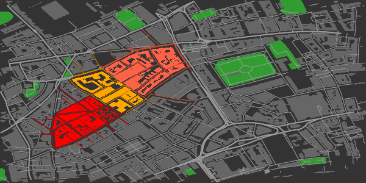

These encircling highways are included in the `london` data provided with
`osmplotr`. 

# 2. Continuous data: `add_osm_surface`

The `add_osm_surface` function enables a continuous data surface to be overlaid
on a map. User-provided data is spatially interpolated across a map region and
OSM items coloured according to a specified continuous colour gradient. The data
must be provided as a data frame with three columns, '(x,y,z)', where '(x,y)'
are the coordinates of points at which data are given, and 'z' are the values to
be spatially interpolated across the map.

A simple data frame can be constructed as
```{r}
n <- 5
x <- seq (bbox [1, 1], bbox [1, 2], length.out = n)
y <- seq (bbox [2, 1], bbox [2, 2], length.out = n)
dat <- data.frame (
    x = as.vector (array (x, dim = c(n, n))),
    y = as.vector (t (array (y, dim = c(n, n)))),
    z = x * y
    )
head (dat)
```
And then passed to `add_osm_surface`
```{r map16, eval = FALSE}
osm_basemap (bbox = bbox,
             bg = 'gray20') %>%
  add_osm_surface (dat_B, 
                   dat = dat, 
                   cols = heat.colors (30)) %>%
  print_osm_map ()
```
```{r map16-print, echo = FALSE}
osm_basemap (bbox = bbox,
             bg = 'gray20') %>%
  add_osm_surface (dat_B, 
                   dat = dat, 
                   cols = heat.colors (30)) %>%
  print_osm_map (filename = 'map_b16.png', 
                 width = 600,
                 units = 'px', 
                 dpi = map_dpi)
```
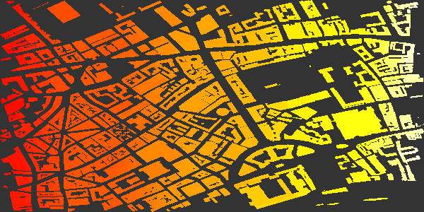

At present, `add_osm_surface` generates an warning if it is applied more than
once to any one kind of `Spatial` object (polygons or lines), as illustrated in
the following code (in which both `dat_H` and `dat_HP` are of class
`SpatialLinesDataFrame`:
```{r, eval = TRUE}
osm_basemap (bbox = bbox, bg = 'gray20') %>%
  add_osm_surface (dat_HP, 
                   dat = dat, 
                   cols = heat.colors (30)) %>%
  add_osm_surface (dat_H, 
                   dat = dat, 
                   cols = heat.colors (30))
```
This is because `add_osm_surface` creates new `ggplot2` aesthetic schemes for
each kind of object, and these schemes are not intended to be modified or
replaced within a single plot. The above map may still be printed, but the
warning means that the last provided colour scheme will be applied to all
objects of that class. This means that `osmplotr` can only overlay two distinct
colour schemes: one for all objects of class `SpatialLines`, and a potentially
different one for all objects of class `SpatialPolygons`.

Of course, any number of additional objects may be overlaid with
`add_osm_objects`, for example,
```{r map17, eval = FALSE}
cols_adj <- adjust_colours (heat.colors (30), -0.2)

map <- osm_basemap (bbox = bbox, 
             bg = 'gray20') %>%
  add_osm_surface (dat_B, 
                   dat = dat, 
                   cols = heat.colors (30)) %>%
  add_osm_surface (dat_HP, 
                   dat = dat, 
                   cols = cols_adj, 
                   size = 1.5) %>%
  add_osm_objects (dat_P, 
                   col = rgb (0.1, 0.3, 0.1)) %>%
  add_osm_objects (dat_H, 
                   col = 'gray60') 

map %>%
  print_osm_map ()
```
```{r map17-print, echo = FALSE}
cols_adj <- adjust_colours (heat.colors (30), -0.2)

map <- osm_basemap (bbox = bbox, 
             bg = 'gray20') %>%
  add_osm_surface (dat_B, 
                   dat = dat, 
                   cols = heat.colors (30)) %>%
  add_osm_surface (dat_HP, 
                   dat = dat, 
                   cols = cols_adj, 
                   size = 1.5) %>%
  add_osm_objects (dat_P, 
                   col = rgb (0.1, 0.3, 0.1)) %>%
  add_osm_objects (dat_H, 
                   col = 'gray60') 

map %>%
  print_osm_map (filename = 'map_b17.png', 
                 width = 600,
                 units = 'px', 
                 dpi = map_dpi)
```
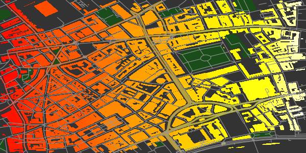


## 2.1 Colourbar legends for data surfaces

A colourbar legend for the surface may be added with `add_colourbar`. As with
`add_axes`, this function is provided separately to allow colourbars to be
overlaid only after all desired map items have been added. The only parameters
required for `add_colourbar` are the limits of the data (`zlims`) and the
colours (along with the `map`, a modified version of which is returned).
```{r map18, eval = FALSE}
map %>%
  add_colourbar (cols = terrain.colors (100), 
                 zlims = range (dat$z)) %>%
  print_osm_map ()
```
```{r map18-print, echo = FALSE}
map %>%
  add_colourbar (cols = terrain.colors (100), 
                 zlims = range (dat$z)) %>%
  print_osm_map (filename = 'map_b18.png', 
                 width = 600, 
                 units = 'px', 
                 dpi = map_dpi)
```
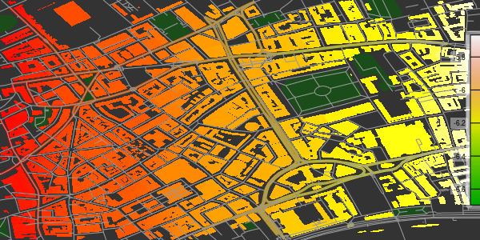

Note that the colours submitted to `add_colourbar` need not be the same as those
used to plot the surface. (Although using different colours is rarely likely to
be useful.) As for `add_axes`, and explained in the first vignette,
[Basic maps](https://cran.r-project.org/package=osmplotr),
the transparency of the boxes surrounding the elements of the colourbar may be
controlled by specifying the value of `alpha`. Both alignment and position may
also be adjusted, as illustrated in this example.
```{r map19, eval = FALSE}
cols_adj <- adjust_colours (heat.colors (30), -0.2)

osm_basemap (bbox = bbox, 
             bg = 'gray20') %>%
  add_osm_surface (dat_B, 
                   dat = dat, 
                   cols = heat.colors (30)) %>%
  add_osm_surface (dat_HP, 
                   dat = dat, 
                   cols = cols_adj, 
                   size = 1.5) %>%
add_colourbar (cols = heat.colors (100), 
               zlims = range (dat$z),
               alpha = 0.9,
               vertical = FALSE,
               barwidth = c(0.1, 0.12), 
               barlength = c(0.5, 0.9),
               text_col = "blue", 
               fontsize = 5, 
               fontface = 3,
               fontfamily = "Times") %>%
  add_axes (colour = "blue", 
            fontsize = 5, 
            fontface = 3,
            fontfamily = "Times") %>%
  print_osm_map ()
```
```{r map19-print, echo = FALSE}
cols_adj <- adjust_colours (heat.colors (30), -0.2)

osm_basemap (bbox = bbox, 
             bg = 'gray20') %>%
  add_osm_surface (dat_B, 
                   dat = dat, 
                   cols = heat.colors (30)) %>%
  add_osm_surface (dat_HP, 
                   dat = dat, 
                   cols = cols_adj, 
                   size = 1.5) %>%
add_colourbar (cols = heat.colors (100), 
               zlims = range (dat$z),
               alpha = 0.9,
               vertical = FALSE,
               barwidth = c(0.1, 0.12), 
               barlength = c(0.5, 0.9),
               text_col = "blue", 
               fontsize = 5, 
               fontface = 3,
               fontfamily = "Times") %>%
  add_axes (colour = "blue", 
            fontsize = 5, 
            fontface = 3,
            fontfamily = "Times") %>%
  print_osm_map (filename = 'map_b19.png', 
                 width = 600,
                 units = 'px', 
                 dpi = map_dpi)
```
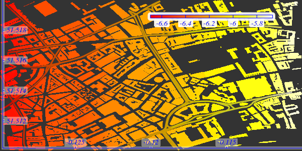

Both `barwidth` and `barlength` can be specified in terms of one or two numbers.
A single value for `barwidth` determines its relative width (0-1) from the
border (the right side if `vertical = TRUE` or the top if `vertical = FALSE`), while
two values determine the relative start and end positions of the sides of the
bar. A single value for `barlength` produces a bar of the given length centred
in the middle of the map, while two values determine its respective upper and
lower points (for `vertical = TRUE`) or left and right points (for
`vertical = FALSE`).

This example also demonstrates how colours, sizes, and other font
characteristics of text labels can be specified (with `text_col` determining the
colour of all elements of the colourbar other than the gradient itself).
Finally, as for `add_axes`, the text labels of colourbars are not currently able
to be rotated because `ggplot2` does not permit rotation for the `geom_label`
function used to produce these labels.

## 2.1 Surfaces and data perimeters

It may often be that user-provided data only extend across a portion of a map,
leaving a perimeter beyond the data boundary for which interpolation should not
be applied. `add_osm_surface` has a `bg` parameter specifying a background
colour for objects beyond the perimeter of the data surface. Passing this
parameter to `add_osm_surface` causes objects beyond the data perimeter to be
coloured within this 'background' colour.

To illustrate, trim the above data to within a circular range of the centre of
the map.
```{r}
d <- sqrt ( (dat$x - mean (dat$x)) ^ 2 + (dat$y - mean (dat$y)) ^ 2)
range (d)
```
Remove from `dat` all rows translating to `d>0.01`:
```{r map20, eval = FALSE}
dat <- dat [which (d < 0.01), ]
cols_adj <- adjust_colours (heat.colors (30), -0.2)

osm_basemap (bbox = bbox, 
             bg = 'gray20') %>%
  add_osm_surface (dat_B, 
                   dat = dat, 
                   cols = heat.colors (30),
                   bg = "gray40") %>%
  add_osm_surface (dat_HP, 
                   dat = dat, 
                   cols = cols_adj,
                   size = c (1.5, 0.5), 
                   bg = "gray70") %>%
  print_osm_map ()
```
```{r map20-print, echo = FALSE}
dat <- dat [which (d < 0.01), ]
cols_adj <- adjust_colours (heat.colors (30), -0.2)

osm_basemap (bbox = bbox, 
             bg = 'gray20') %>%
  add_osm_surface (dat_B, 
                   dat = dat, 
                   cols = heat.colors (30),
                   bg = "gray40") %>%
  add_osm_surface (dat_HP, 
                   dat = dat, 
                   cols = cols_adj,
                   size = c (1.5, 0.5), 
                   bg = "gray70") %>%
  print_osm_map (filename = 'map_b20.png', 
                 width = 600,
                 units = 'px', 
                 dpi = map_dpi)
```
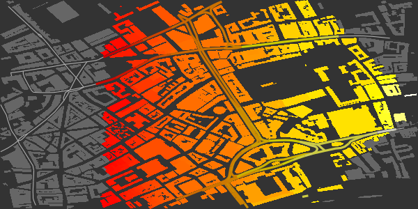

(The perimeter is irregular because of the positions of the points in `dat`.)

## 2.3 Further control of surface appearance

The final `add_osm_surface` call in the above code (for `dat_HP`) illustrates
additional parameters that may be passed for further control of map appearance.
In this case, the two `size` parameters control the size of the lines within the
data surface and beyond its perimeter. Single values may also be passed, in
which case they determine the width of lines in both cases. One or two `shape`
parameters may also be passed, with these also determining the shapes of
`SpatialPoints`, as illustrated in the next example, which overlays trees on the
map.

Both lines and points use the same `ggplot2` colour gradient, and so adding the
second of these again generates an error and means that the actual colour scheme
will be determined by the final call to add either lines or points.

```{r, eval = FALSE}
dat_T <- extract_osm_objects (key = 'tree', bbox = bbox)
```
```{r, echo = FALSE}
dat_T <- london$dat_T
```

```{r map21, eval = FALSE}
osm_basemap (bbox = bbox, 
             bg = 'gray20') %>%
  add_osm_surface (dat_HP, 
                   dat = dat, 
                   cols = terrain.colors (30),
                   size = c (1.5, 0.5), 
                   bg = "gray70") %>%
  add_osm_surface (dat_H, 
                   dat = dat, 
                   cols = terrain.colors (30),
                   size = c (1, 0.5), 
                   bg = "gray70") %>%
  add_osm_surface (dat_T, 
                   dat = dat, 
                   cols = heat.colors (30),
                   bg = "lawngreen", 
                   size = c(3, 2), 
                   shape = c(8, 1)) %>%
  print_osm_map ()
```
```{r map21-print, echo = FALSE}
osm_basemap (bbox = bbox, 
             bg = 'gray20') %>%
  add_osm_surface (dat_HP, 
                   dat = dat, 
                   cols = terrain.colors (30),
                   size = c (1.5, 0.5), 
                   bg = "gray70") %>%
  add_osm_surface (dat_H, 
                   dat = dat, 
                   cols = terrain.colors (30),
                   size = c (1, 0.5), 
                   bg = "gray70") %>%
  add_osm_surface (dat_T, 
                   dat = dat, 
                   cols = heat.colors (30),
                   bg = "lawngreen", 
                   size = c(3, 2), 
                   shape = c(8, 1)) %>%
  print_osm_map (filename = 'map_b21.png', 
                 width = 600,
                 units = 'px', 
                 dpi = map_dpi)
```
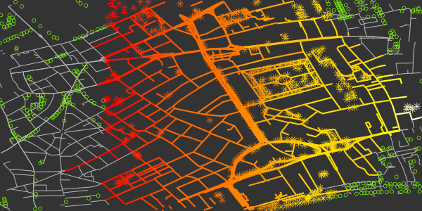

The first two colour specifications (`terrain.colors`) have been ignored, and
all added items are coloured according to the final value of `heat.colors (30)`.
Other aspects such as line sizes and point shapes are nevertheless respected.

