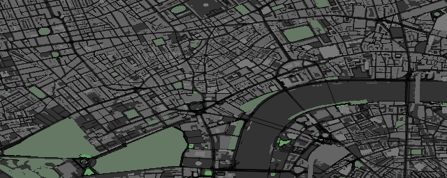
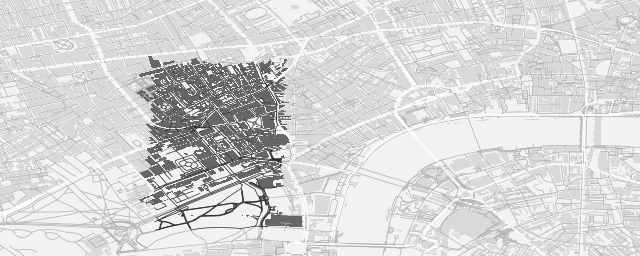

```{r load, include=FALSE}
setwd ("../..")
devtools::load_all ("osmplotr")
setwd ("./osmplotr/vignettes")
```

# Making Maps

This `R` package is designed to produce visually impressive graphical plots of
OpenStreetMap (OSM) data. All of the following examples display results for a
small portion of central London, U.K. All data are downloaded from the
[overpass API](https://overpass-api.de).  

A simple map may be produced using the following simple steps:
```{r, echo=FALSE}
# Combining (dat_B, dat_BC) and (dat_H, dat_HP) requires removing the repeated
# objects
indx <- which (!london$dat_BR$id %in% london$dat_BNR$id)
dat_B <- maptools::spRbind (london$dat_BR [indx,], london$dat_BNR)
indx <- which (!london$dat_H$id %in% london$dat_HP$id)
dat_H <- maptools::spRbind (london$dat_H [indx,], london$dat_HP)
```
1. Specify the bounding box for the desired region
```{r}
bbox <- c(-0.15,51.5,-0.1,51.52) 
```
2. Download the desired data---in this case, all building perimeters.
```{r, eval=FALSE}
dat_B <- extract_osm_objects (key="building", bbox=bbox)
```
3. Initiate an `osm_basemap` with desired background (`bg`) colour
```{r map1, eval=TRUE}
plot_osm_basemap (xylims=get_xylims (bbox), bg="gray20", file="map1.png")
```
```{r, echo=FALSE}
graphics.off ()
```


4. Add desired plotting objects
```{r, eval=FALSE}
add_osm_objects (dat_B, col="gray40")
```
```{r map2, eval=TRUE, echo=FALSE}
plot_osm_basemap (xylims=get_xylims (bbox), bg="gray20", file="map2.png")
add_osm_objects (dat_B, col="gray40")
graphics.off ()
```

5. When finished, close graphics device
```{r}
graphics.off ()
```

## 1. A simple map

OSM data for particular types of objects can be downloaded using
`extract_osm_objects`.
```{r}
```
```{r, eval=FALSE}
dat_B <- extract_osm_objects (key="building", bbox=bbox)
dat_H <- extract_osm_objects (key="highway", bbox=bbox)
```
This function returns spatial (`sp`) `data.frame` objects of an appropriate
types.
```{r}
class (dat_B)
class (dat_H)
```
The `SpatialPolygonsDataFrame` (SPDF) and `SpatialLinesDataFrame` (SLDF) of
London buildings and highways contain 
```{r}
length (dat_B)
length (dat_H)
```
... 6,209 building polygons and 4,524 highway lines.

Note that plotting maps requires first making a basemap with a specified
background colour. The basemap also defines the dimensions of the plot, which
may be scaled in proportion to the latitudinal and longitudinal range of the
objects to be plotted using `get_xylims`, or any other desired limits may be
passed. Objects may then be overlaid on this basemap using `add_osm_objects`.
```{r map3, eval=TRUE}
xylims <- get_xylims (dat_B)
plot_osm_basemap (xylims=xylims, bg="gray20", file="map1.png")
add_osm_objects (dat_B, col="gray40")
add_osm_objects (dat_H, col="gray70")
graphics.off ()
```


Other graphical parameters can also be passed to `add_osm_objects`, such as
border colours or line widths and types. For example,
```{r map4, eval=TRUE}
plot_osm_basemap (xylims=xylims, bg="gray20", file="map2.png")
add_osm_objects (dat_B, col="gray40", border="orange", lwd=0.1)
graphics.off ()
```


This package is generally intended to produce high quality graphical output
written to particular graphic devices such as `png` or `jpeg` (see `?png` for a
list of possible devices). Map production generally involves the sequential
addition of objects, for which the graphic device must remain open. It is
important once finished a map to close the device with `dev.off` or
`graphics.off`.

## 2. OSM Structures

OSM structures are identified through `key-value` pairs. The preceding calls to
`extract_osm_objects` did not specify any values, and so returned all objects
matching the `key`, regardless of value. Particular values can also be
requested:
```{r, eval=FALSE}
dat_BR <- extract_osm_objects (key="building", value="residential", bbox=bbox)
dat_HP <- extract_osm_objects (key="highway", value="primary", bbox=bbox)
```
```{r, echo=FALSE}
dat_BR <- london$dat_BR
dat_HP <- london$dat_HP
```
```{r}
length (dat_BR)
```
```{r map5, eval=TRUE}
plot_osm_basemap (xylims=xylims, bg="gray20", file="map3.png")
add_osm_objects (dat_BR, col="gray40")
add_osm_objects (dat_HP, col="gray70")
graphics.off ()
```


(There are evidently very few buildings in this part of London marked as
'residential'.)

### 2a. Negation

Values can also be negated through the prefix `!`---for example, non-primary
highways can be extracted, and primary highways overlaid in a different colour.
```{r, eval=FALSE}
dat_H <- extract_osm_objects (key="highway", value="!primary", bbox=bbox)
```
```{r, echo=FALSE}
dat_H <- london$dat_H
```
```{r map6, eval=TRUE}
plot_osm_basemap (xylims=xylims, bg="gray20", file="map4.png")
add_osm_objects (dat_H, col="gray50")
add_osm_objects (dat_HP, col="gray80")
graphics.off ()
```


Or non-residential buildings can be extracted.
```{r, eval=FALSE}
dat_BNR <- extract_osm_objects (key="building", value="!residential", bbox=bbox)
```
```{r, echo=FALSE}
dat_BNR <- london$dat_BNR
```
```{r map7, eval=TRUE}
plot_osm_basemap (xylims=xylims, bg="gray20", file="map5.png")
add_osm_objects (dat_BR, col="gray80")
add_osm_objects (dat_BNR, col="gray40")
graphics.off ()
```


### 2b. Additional `key-value` pairs

`extract_osm_objects` accepts an additional argument `extra_pairs` through which
additional OSM `key-value` pairs can be passed to the 
[overpass API](https://overpass-api.de). For example, the polygon of a
particular building can be extracted by passing its name:
```{r, eval=FALSE}
extra_pairs <- c ("name", "Royal.Festival.Hall")
dat_RFH <- extract_osm_objects (key="building", extra_pairs=extra_pairs, 
                                bbox=bbox)
```
Or a street address can be given:
```{r, eval=FALSE}
extra_pairs <- list (c ("addr:street", "Stamford.St"),
                     c ("addr:housenumber", "150"))
dat_ST <- extract_osm_objects (key="building", extra_pairs=extra_pairs, 
                                bbox=bbox)
```
As mentioned, additional graphics arguments can be passed to `add_osm_objects`,
as illustrated in the following.
```{r, echo=FALSE}
dat_RFH <- london$dat_RFH
dat_ST <- london$dat_ST
```
```{r map8, eval=TRUE}
xylims <- list (xrange=c(-0.118, -0.110), yrange=c(51.504, 51.507))
plot_osm_basemap (xylims=xylims, bg="gray95", file="map6.png", width=480)
add_osm_objects (dat_H, col="gray80")
add_osm_objects (dat_HP, col="gray60", lwd=4)
add_osm_objects (dat_RFH, col="orange", border="red", lwd=3)
add_osm_objects (dat_ST, col="skyblue", border="blue", lwd=3)
graphics.off ()
```


## 3. Automating map production

Map production can be automated with `make_osm_map`.
The structure of a map is defined by `osm_structures`, which returns a
`data.frame` containing OSM `key-value` pairs and associated colours. 

```{r}
osm_structures ()
```

`osm_structures` recognises many common structures and converts them into
`key-value` pairs which can be submitted to the 
[overpass API](https://overpass-api.de).  Many structures are identified by keys
only, in which cases the values are empty strings.

```{r}
osm_structures()$value [1:4]
```

The last row of `osm_structures` exists only to define the background colour of
the map. Objects in maps are overlaid on the plot accoording to the order of
rows in `osm_structures`. This can be readily changed or restricted simply by
submitting desired structures in a desired order.

```{r}
struct_types <- c ("amenity", "building", "grass", "highway", "natural", "park")
osm_structures (struct_types, col_scheme="light")
```

In addition to `osm_structures`, one of the arguments which may be passed to
`make_osm_map` is `osm_data`. If NULL (default), then all data passed in the
`structures` argument are downloaded. Any data that have already been downloaded
may be passed (as a list) as `osm_data`. Each item of this list must be named by
combining the given `dat_prefix` with the suffix given in `osm_structures`.  Any
additional data present in `osm_structures` yet not in `osm_data` will be
downloaded.

`osmplotr` includes example data for a small area of central London, U.K.
(`bbox=c(-0.15,51.5,-0.1,51.52)`)---see `?london`
```{r}
names (london)
```
The `osm_structures` describing these data are
```{r}
struct_types <- c ("highway", "highway", "building", "building", "building",
                 "amenity", "grass", "park", "natural")
structures <- osm_structures (structures=struct_types, col_scheme="dark")
structures$value [1] <- "!primary"
structures$value [2] <- "primary"
structures$suffixes [2] <- "HP"
structures$value [3] <- "!residential"
structures$value [4] <- "residential"
structures$value [5] <- "commercial"
structures$suffixes [3] <- "BNR"
structures$suffixes [4] <- "BR"
structures$suffixes [5] <- "BC"
structures
```
plus additional data for two particular buildings as shown above.
```{r, eval=FALSE}
extra_pairs <- c ("name", "Royal.Festival.Hall")
london$dat_RFH <- extract_osm_objects (key="building", extra_pairs=extra_pairs, 
                                bbox=bbox)
extra_pairs <- list (c ("addr:street", "Stamford.St"),
                     c ("addr:housenumber", "150"))
london$dat_ST <- extract_osm_objects (key="building", extra_pairs=extra_pairs, 
                                bbox=bbox)
```

The above `structures` can be used to make a map using the `london` data:
```{r map9, eval=TRUE}
osm_data <- make_osm_map (osm_data=london, structures=structures, 
                          dat_prefix="dat_", file="map7.png")
graphics.off ()
```


Because no bounding box was passed to `make_osm_map`, a bounding box is
extracted as the **largest** box spanning all objects in `osm_data`. These
objects include the highways which extend notably further to the north and west
than the actual bounding box used to extract these highways. Passing the
previous bounding box to the same call gives:
```{r map10, eval=TRUE}
osm_data <- make_osm_map (osm_data=london, structures=structures, 
                          dat_prefix="dat_", bbox=bbox, file="map8.png")
graphics.off ()
```



## 4. Highlighting particular areas

One of the primary aims of `osmplotr` is to offer a convenient means to
highlight particular regions within a city simply by applying different colours
to the same OSM structures. The routine which enables this is
`group_osm_objects`, the two primary arguments to which are `obj`, which defines
the OSM structure to be used for plotting the regions (for example, `dat_B`
defining the previous buildings), and `groups` which is a list of SpatialPoints
objects defining the regions.

The simplest way of defining a region is with `click_map`, which enables a map
to be clicked and returns a set of `SpatialPoints` corresponding to the clicks.
(`click_map` finishes when the same point is clicked twice.) This set of points,
or a set of points generated through any other means, can then be passed as the
`groups` argument to `group_osm_objects`.

```{r, echo=FALSE}
indx <- which (!london$dat_BR$id %in% london$dat_BNR$id)
dat_B <- maptools::spRbind (london$dat_BR [indx,], london$dat_BNR)
```
```{r map11, eval=TRUE}
pts <- sp::SpatialPoints (cbind (c (-0.120, -0.135, -0.135, -0.120),
                             c (51.510, 51.510, 51.516, 51.516)))
xylims <- get_xylims (c (-0.14, 51.505, -0.11, 51.52))
plot_osm_basemap (xylims=xylims, bg="gray20", file="map9.png")
group_osm_objects (dat_B, groups=pts, col="orange", col_extra="gray40",
                   colmat=FALSE) 
graphics.off ()
```


### 4.1 Inclusive, exclusive, and bisected polygons

The highlighted region of the previous map is irregular because inclusion for
each polygon within a group is defined by mean coordinates. `group_osm_objects`
has a `boundary` argument which defines whether objects should be assigned to
groups inclusively (`boundary>0`) or exclusively (`boundary<0`), or whether they
should be precisely bisected by a group border (`boundary=0`). The two options
in addition to the default of `boundary=-1` produce the following maps. 

```{r map12, eval=TRUE}
plot_osm_basemap (xylims=xylims, bg="gray20", file="map10.png")
group_osm_objects (dat_B, pts, col="orange", col_extra="gray40", colmat=FALSE,
                   boundary=0)
graphics.off ()
```

```{r map13, eval=TRUE}
plot_osm_basemap (xylims=xylims, bg="gray20", file="map11.png")
group_osm_objects (dat_B, groups=pts, col="orange", col_extra="gray40", 
                   colmat=FALSE, boundary=1)
graphics.off ()
```


The ability to combine inclusive and bisected polygons is particularly useful
when selected areas partially contain large polygons such as parks. The
following map is created with buildings plotting *inclusively* within the group,
and parks bisected by the boundary.

```{r}
xylims <- get_xylims (c (-0.15, 51.5, -0.1, 51.52)) # zoom out again
pts <- sp::SpatialPoints (cbind (c (-0.128, -0.138, -0.138, -0.128),
                             c (51.502, 51.502, 51.515, 51.515)))
```
```{r map14, eval=TRUE}
plot_osm_basemap (xylims=xylims, bg="gray20", file="map12.png")
group_osm_objects (dat_B, groups=pts, col="orange", col_extra="gray40", 
                   colmat=FALSE, boundary=1)
col_park_in <- rgb (50, 255, 50, maxColorValue=255)
col_park_out <- rgb (50, 155, 50, maxColorValue=255)
group_osm_objects (london$dat_P, groups=pts, col=col_park_in, 
                   col_extra=col_park_out, colmat=FALSE, boundary=0)
graphics.off ()
```


Bisection allocates points either to within or beyond a given boundary, with
resultant polygons generally separated by a visible gap between locations at
which the polygons are defined.  Because plotting is progressively overlaid,
such gaps can nevertheless be avoided simply by initially plotting underlying
layers prior to grouping objects:

```{r}
xylims <- get_xylims (c (-0.15, 51.5, -0.1, 51.52)) # zoom out again
pts <- sp::SpatialPoints (cbind (c (-0.128, -0.138, -0.138, -0.128),
                             c (51.502, 51.502, 51.515, 51.515)))
```
```{r map15, eval=TRUE}
plot_osm_basemap (xylims=xylims, bg="gray20", file="map13.png")
group_osm_objects (dat_B, groups=pts, col="orange", col_extra="gray40", 
                   colmat=FALSE, boundary=1)
add_osm_objects (london$dat_P, col=col_park_out)
col_park_in <- rgb (50, 255, 50, maxColorValue=255)
col_park_out <- rgb (50, 155, 50, maxColorValue=255)
group_osm_objects (london$dat_P, groups=pts, col=col_park_in, 
                   col_extra=col_park_out, colmat=FALSE, boundary=0)
graphics.off ()
```


### 4.2 The Colour Matrix: Colouring Several Regions

Individual studies of particular regions are almost always based on
*representative* data sampled at some particular set of points. Presuming such
sample points to represent the underlying sample structure, they are commonly
subject to clustering analyses of some form or other, resuling in a spatial
partition between clusters (whether potentially overlapping or not). In such
cases, every location within a given plot will be considered to belong to some
particular group(s), yet the plot must distinguish these groups by colour alone.
Beyond a handful of groups, manually devising an appropriate colour scheme may
become difficult.

`osmplotr` offers a convenient way to allocate systematiclly distinct colours to
spatially distinct groups with the `colour_mat` function.

```{r, fig.width=5}
plot.new ()
cmat <- colour_mat (plot=TRUE)
```

This function accepts a vector of 4 or more colours assinged to each corner of a
rectangular grid of defined size(s). The interior of the grid is then filled
through interpolation. The default colours are `rainbow (4)` (or red, green,
violet, blue), as illustrated above.

Regional groups may be coloured using `colour_mat` by setting `colmat=TRUE` in
`group_osm_objects` and by submitting a desired vector of colours. A
`colour_mat` may be illustrated by plotting inclusive groups defined by random
points. `group_osm_objects` first discerns which components (polygons or lines)
lie *within* groups, then if `col_extra=NULL` (or `NA`), all points are assigned
to the nearest group. This nevertheless requires the initial groups to be of
non-zero size, and so the following lines initially select random points and
then extend them by creating small rectangles around each.
```{r}
set.seed (2)
ngroups <- 12
x <- xylims$xrange [1] + runif (ngroups) * diff (xylims$xrange)
y <- xylims$yrange [1] + runif (ngroups) * diff (xylims$yrange)
groups <- cbind (x, y)
groups <- apply (groups, 1, function (i) 
              sp::SpatialPoints (matrix (i, nrow=1, ncol=2)))
# Then create small rectangles around each pts
groups <- lapply (groups, function (i)
               {
                   x <- sp::coordinates (i) [1] + c (-0.002, 0.002, 0.002,
                                                     -0.002)
                   y <- sp::coordinates (i) [2] + c (-0.002, -0.002, 0.002,
                                                     0.002)
                   sp::SpatialPoints (cbind (x, y))
               })
```
The `ngroups` can then simply be plotted as follows.
```{r map16, eval=TRUE}
plot_osm_basemap (xylims=xylims, bg="gray20", file="map14.png")
group_osm_objects (dat_B, groups=groups, col_extra=NA, make_hull=FALSE,
                   colmat=TRUE, lwd=3)
graphics.off ()
```


The `colour_mat` function has an option to rotate the colour space. This may
also be passed directly to `group_osm_objects` enabling, for example, the
colours in the previous plot to be rotate by 90 degrees.

```{r map17, eval=TRUE}
plot_osm_basemap (xylims=xylims, bg="gray20", file="map15.png")
group_osm_objects (dat_B, groups=groups, col_extra=NA, make_hull=FALSE,
                   colmat=TRUE, rotate=90, lwd=3)
graphics.off ()
```

