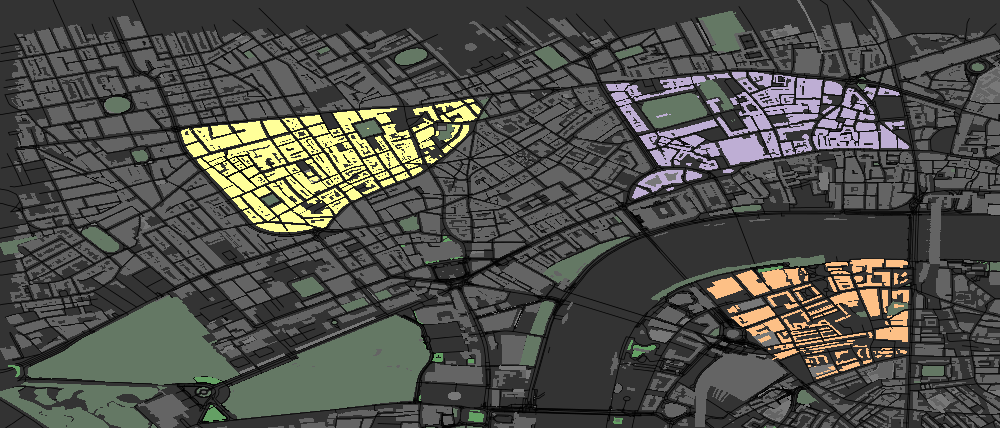

```{r, include=FALSE}
setwd ("../..")
devtools::load_all ("urbanplotr")
setwd ("./urbanplotr/vignettes")
```

# Making Maps



This `R` package is designed to produce visually impressive graphical plots of
OpenStreetMap (OSM) data. The above illustrates a small portion of central
London, with selected areas highlighted. All data are downloaded from the
[overpass API](https://overpass-api.de).  

## The structure of a map

The structure of a map is defined by `osm_structures`, which returns a
`data.frame` containing OSM `key-value` pairs and associated colours. 

```{r}
osm_structures ()
```

where the default structures included are

```{r}
osm_structures ()$structures
```

`osm_structures` recognises many common structures and converts them into
`key-value` pairs which can be submitted to the 
[overpass API](https://overpass-api.de).  Many structures are identified by keys
only, in which cases the values are empty strings.

```{r}
osm_structures()$value [1:4]
```

The last row of `osm_structures` exists only to define the background colour of
the map. `osm_structures` makes it easy to automatically produce maps with the
plot order given by the order of the structures. This can be readily changed
or restricted simply by submitting desired structures in a desired order.

```{r}
struct_types <- c ("amenity", "building", "grass", "highway", "natural", "park")
structures <- osm_structures (struct_types, col_scheme="light")
structures
```
