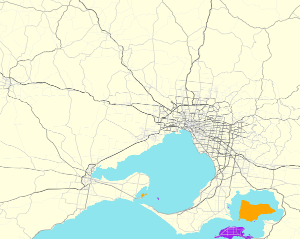
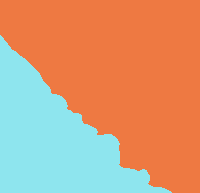

# 1 Introduction

It may often be desirable to separately colour two or more portions of a map
that are separated by a line object. This is not directly possible because only
polygons can be filled with colour, not lines. The `osm_line2poly()` function
comes to the rescue here by converting a line to a polygon surrounding a given
plotting region. The classic example where this arises is with coastlines. These
are always represented in OpenStreetMap as line objects, preventing any ability
to simply colour land and ocean separately.

This vignette illustrates the general principles of the `osm_line2poly()`
function, along with several ancilliary issues such as plotting coastal islands.
Although this functionality has been primarily developed with coastlines in
mind, the `osm_line2poly()` function has been designed in a suffciiently general
manner to be readily adaptible to any other cases where such line-to-polygon
conversion may be desirable.

This vignette explores the example of the coastline around Greater Melbourne,
Australia, first demonstrating how to extract coastline and convert it to land
and sea polygons, and then demonstrating how these areas may be delinated on a
plot.

# 2 Data Extraction and Conversion

We use [`osmdata`](https://cran.r-project.org/package=osmdata) to extract the
coastline within the bounding box of Greater Melbourne.
```{r, echo = FALSE}
map_dpi <- 72 # dpi res for all maps
fetch_osm <- FALSE
```
```{r GMFuncs, message=FALSE, eval = fetch_osm}
library (osmplotr)
library (osmdata)
library (magrittr)

bbox <- osmdata::getbb ("greater melbourne, australia")
coast <- opq (bbox = bbox) %>%
    add_osm_feature (key = "natural", value = "coastline") %>%
    osmdata_sf (quiet = FALSE)
```
This coastline object consists of several types of structure
```{r, eval = FALSE}
coast
```
```{r, echo = FALSE}
message (paste0 ("Object of class 'osmdata' with:\n",
"                 $bbox : -38.49937,144.44405,-37.40175,146.1925\n",
"        $overpass_call : The call submitted to the overpass API\n",
"            $timestamp : [ Thurs 5 Oct 2017 10:23:18 ]\n",
"           $osm_points : 'sf' Simple Features Collection with 13635 points\n",
"            $osm_lines : 'sf' Simple Features Collection with 73 linestrings\n",
"         $osm_polygons : 'sf' Simple Features Collection with 12 polygons\n",
"       $osm_multilines : 'sf' Simple Features Collection with 0 multilinestrings\n",
"    $osm_multipolygons : 'sf' Simple Features Collection with 0 multipolygons"))
```
Because OpenStreetMap represents coastline as line objects, all coastline data
is contained within the `$osm_lines` object. The `osm_line2poly()` function can
then converte these lines to polygons which can be used to plot filled areas.
```{r, eval = fetch_osm}
coast_poly <- osm_line2poly (coast$osm_lines, bbox)
names(coast_poly)
```
```{r, echo = FALSE}
c ("sea", "land", "islands")
```
Note that reflecting its envisioned primary usage, the function always returns
objects named `"sea"`, `"land"`, and `"islands"`. For usages other than
coastline, these names will of course reflect other kinds of object.  The
`"islands"` item contains any polygons which are separate to those originally
queried. Each item of this list is an `sf::data.frame` object:
```{r, eval = FALSE}
class (coast_poly$sea)
```
```{r, echo = FALSE}
c ("sf", "data.frame")
```

# 3 Plotting

The `list` items returned by `osm_line2poly()` may then be used to provide a map
background which distinguishes ocean from land. Here we first colour the entire
map using the background colour for the ocean, and overlay the land and island
polygons on top of that.

```{r, eval = fetch_osm}
map <- osm_basemap (bbox = bbox, bg = "cadetblue2") %>%
  add_osm_objects (coast_poly$land, col = "lightyellow1") %>%
  add_osm_objects (coast_poly$islands, col="orange") %>%
  add_osm_objects (coast$osm_polygons, col="purple", border = "black") %>%
  add_osm_objects (coast$osm_lines, col="black") %>%
  print_osm_map ()
```
```{r, echo=FALSE, eval = fetch_osm}
print_osm_map (map, filename = 'melb_a1.png', width = 600,
               units = 'px', dpi = map_dpi)
```



The gaudy colours differentiate the source of polygons. Purple islands were
returned by the original osm query, while the orange ones were constructed from
fragments by `osm_line2poly`.

# Further Demonstrations

The `osm_line2poly()` function works by identifying lines which extend at at
least two points beyond a given bounding box. For coastline, OpenStreetMap is
designed so that land always lies to the left side in the direction of the
line, enabling water and land to be systematically distinguished. The following
test cases demonstrate the reliability of this distinction.

```{r, echo=FALSE}
  getCoast <- function(bbox)
  {
    qry <- opq(bbox)
    qry <- add_osm_feature(qry, key = "natural", value = "coastline")
    return(osmdata_sf(qry))
  }
  testPlot <- function(coast, bbox)
  {
    if (!dev.cur()) dev.off()
    map <- osm_basemap(bbox=bbox)
    map <- add_osm_objects(map, coast$osm_lines)
    print_osm_map(map)
  }
  testPlotPoly <- function(coast, bbox, fname)
  {
    ## trouble doing this check properly on Travis
    if (nrow(coast$osm_lines) > 0) {
      coastp <- osm_line2poly(coast$osm_lines, bbox=bbox)
      map <- osm_basemap(bbox=bbox)
      map <- add_osm_objects(map, coastp$sea, col='cadetblue2')
      map <- add_osm_objects(map, coastp$land, col='sienna2')
      print_osm_map(map,filename = fname, width = 200,
                    units = 'px', dpi = map_dpi)
    } else {
      warning("osm query probably failed - not plotting")
      invisible(NULL)
    }
    
  }
  
```
```{r, eval = fetch_osm}
test_plot <- function (bbox)
{
    dat <- opq (bbox) %>%
        add_osm_feature (key = "natural", value = "coastline") %>%
        osmdata_sf (quiet = FALSE)
    coast <- osm_line2poly (dat$osm_lines, bbox)
    osm_basemap (bbox = bbox) %>%
        add_osm_objects(coast$sea, col = 'cadetblue2') %>%
        add_osm_objects(coast$land, col = 'sienna2')
}
```
```{r, eval = fetch_osm, echo = FALSE}
test_plot <- function (bbox, filename, map_dpi)
{
    dat <- opq (bbox) %>%
        add_osm_feature (key = "natural", value = "coastline") %>%
        osmdata_sf (quiet = FALSE)
    coast <- osm_line2poly (dat$osm_lines, bbox)
    osm_basemap (bbox = bbox) %>%
        add_osm_objects(coast$sea, col = 'cadetblue2') %>%
        add_osm_objects(coast$land, col = 'sienna2') %>%
        print_osm_map (file = filename, width = 200,
                       units = "px", dpi = map_dpi)
}
```
Fetch the test data. A variable name with `WE` indicates that the coast enters the bounding box
on the western side and exits on the east. The land is on the left when following that path.
```{r, eval = fetch_osm}
    bbWE <- get_bbox (c(142.116906, -38.352713, 142.205162, -38.409661))
    coastWE <- getCoast(bbWE)

    bbEW <- get_bbox(c(144.603127, -38.104003, 144.685557, -38.135596))
    coastEW <- getCoast(bbEW)

    bbNS <- get_bbox(c(143.807998, -39.770986, 143.906494, -39.918643))
    coastNS <- getCoast(bbNS)

    bbSN <- get_bbox(c(144.073544, -39.854586, 144.149318, -39.960047))
    coastSN <- getCoast(bbSN)

    bbWW <- get_bbox(c(144.904865, -37.858295, 144.923679, -37.874367))
    coastWW <- getCoast(bbWW)

    bbEE <- get_bbox(c(144.643383, -38.294671, 144.692197, -38.336022))
    coastEE <- getCoast(bbEE)

    bbNN <- get_bbox(c(145.856321, -38.831642, 146.050920, -38.914031))
    coastNN <- getCoast(bbNN)

    bbSS <- get_bbox(c(146.363768, -38.770345, 146.486389, -38.837287))
    coastSS <- getCoast(bbSS)

    bbEN <- get_bbox(c(144.738212, -38.337690, 144.758053, -38.346966))
    coastEN <- getCoast(bbEN)

    bbEWWS <- get_bbox(c(144.693077, -38.307526, 144.729113, -38.343997 ))
    coastEWWS <- getCoast(bbEWWS)

    bbWS <- get_bbox(c(143.164906 ,-38.704885, 143.2075563, -38.7462058 ))
    coastWS <- getCoast(bbWS)

```

```{r, eval = fetch_osm}
testPlotPoly(coastWE, bbWE, "testWE.png")
```

```{r, eval = fetch_osm}
testPlotPoly(coastEW, bbEW, "testEW.png")
```


```{r, eval = fetch_osm}
testPlotPoly(coastNS, bbNS, "testNS.png")
```


```{r, eval = fetch_osm}
testPlotPoly(coastSN, bbSN, "testSN.png")
```


```{r, eval = fetch_osm}
testPlotPoly(coastWW, bbWW, "testWW.png")
```


```{r, eval = fetch_osm}
testPlotPoly(coastEE, bbEE, "testEE.png")
```


```{r, eval = fetch_osm}
testPlotPoly(coastNN, bbNN, "testNN.png")
```


```{r, eval = fetch_osm}
testPlotPoly(coastSS, bbSS, "testSS.png")
```


```{r, eval = fetch_osm}
testPlotPoly(coastEN, bbEN, "testEN.png")
```


```{r, eval = fetch_osm}
testPlotPoly(coastEWWS, bbEWWS, "testEWWS.png")
```


```{r, eval = fetch_osm}
testPlotPoly(coastWS, bbWS, "testWS.png")
```

